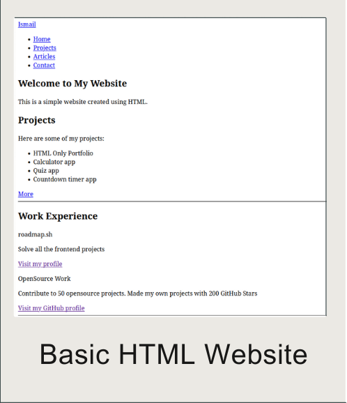

# Front-end Projects from Roadmap.sh

This repository contains front-end projects built following the [roadmap.sh](https://roadmap.sh/) front-end developer path.

## Projects List

<ul>
<li><a href="https://roadmap.sh/projects/single-page-cv" target="_blank">Single-Page CV</a></li>
<li><a href="https://roadmap.sh/projects/basic-html-website" target="_blank">Basic HTML Website</a></li>
</ul>

Click any of the images below to view the readme and live demo of the project.

  
  

